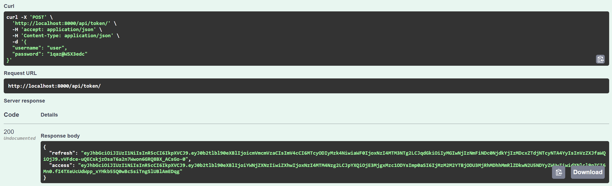
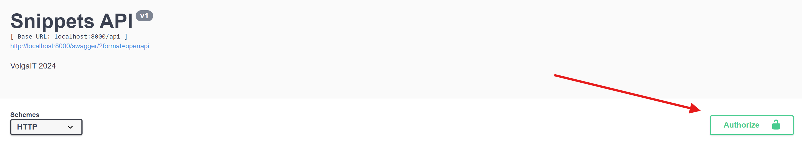
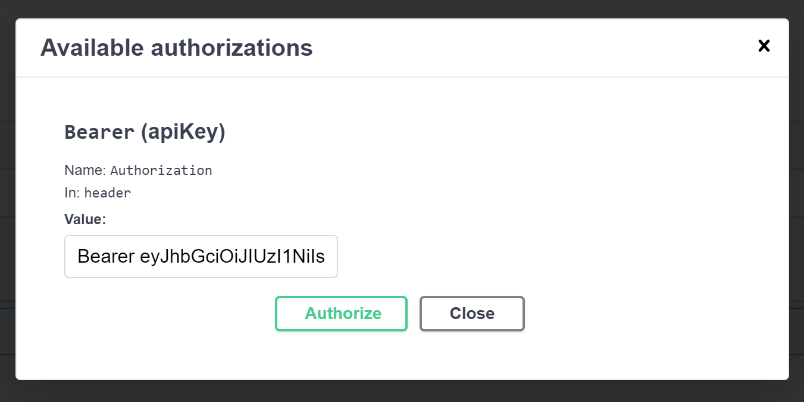

# Проект: Волков Владислав

---

### Swagger URL: http://localhost:8000/swagger/

---

## Запуск приложения

Для запуска приложения используйте следующую команду:

```bash
$ docker-compose up --build -d
```

После выполнения команды на порту **8000** будет запущен сервер с заранее загруженным дампом данных.

### Доступные аккаунты:

#### Пользователь
- **Имя пользователя:** `user`
- **Пароль:** `1qaz@WSX3edc`

#### Администратор
- **Имя пользователя:** `admin`
- **Пароль:** `admin`

---

## Swagger

Добавлена возможность авторизации по jwt токену, чтобы проверить работу ограничений, для этого следует получить токен по эндпоинту **/token/**, авторизовавшись
через один из предустановленных аккаунтов. Пример:

**Получение access токена**:




**Использование access токена для авторизации**:

_Формат вставки_: Bearer <access_token>